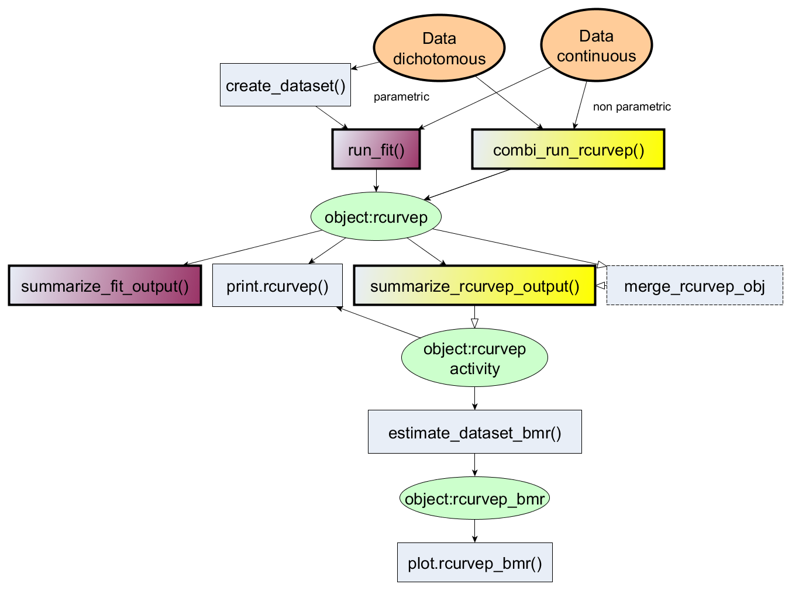
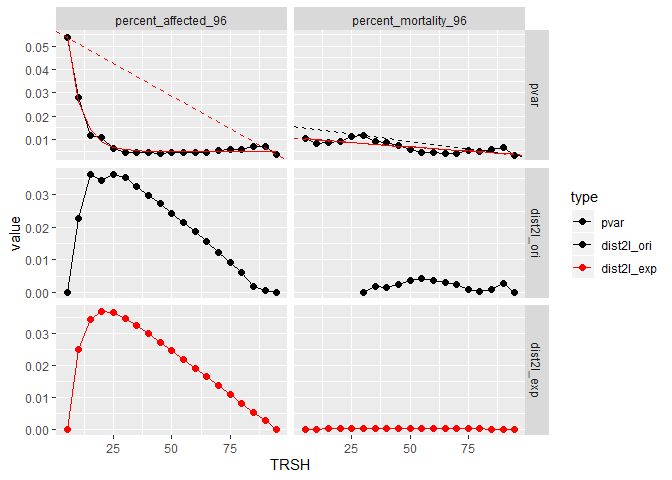

## Overview

The package provides an R interface for processing
**concentration-response datasets** using Curvep, a response noise filtering algorithm. The algorithm was described in the publications (Sedykh A et al. (2011) [doi:10.1289/ehp.1002476](https://doi.org/10.1289/ehp.1002476) and Sedykh A (2016) [doi:10.1007/978-1-4939-6346-1_14](https://doi.org/10.1007/978-1-4939-6346-1_14)). 

Other parametric fitting approaches (e.g., Hill equation) are also adopted for ease of comparison. 3-parameter Hill equation from original _tcpl_ package (Filer DL et al.,  [doi:10.1093/bioinformatics/btw680](https://doi.org/10.1093/bioinformatics/btw680)) and 4-parameter Hill equation from Curve Class2 approach(Wang Y et al.,  [doi:10.2174/1875397301004010057](https://doi.org/10.2174/1875397301004010057)) are available. 

Also, methods for calculating the confidence interval around the activity metrics are also provided. The methods are based on the bootstrap approach to simulate the datasets (Hsieh J-H et al. [doi:10.1093/toxsci/kfy258](https://doi.org/10.1093/toxsci/kfy258)). The simulated datasets can be used to derive the baseline noise threshold in an assay endpoint. This threshold is critical in the toxicological studies to derive the point-of-departure (POD).

## Installation

``` r
# the development version from GitHub:
# install.packages("devtools")
devtools::install_github("moggces/Rcurvep")
devtools::install_github("moggces/Rcurvep", build_vignettes = TRUE)
```

## Package structure



## Usage

### Run analysis

``` r
library(Rcurvep)
data("zfishbeh")
out_curvep <- combi_run_rcurvep(zfishbeh, TRSH = 30)  # using Curvep with BMR = 30
out_fit1 <- run_fit(zfishbeh, modls = "cc2") # using Curve Class2 4-parameter hill
out_fit2 <- run_fit(zfishbeh, modls = c("cnst", "hill")) # using tcpl 3-parameter hill + constant model
```

### Find BMR

``` r
data("zfishdev_act")
out_bmr <- estimate_dataset_bmr(zfishdev_act)
```

    ## $`1`

<!-- -->

## More Usage

To learn more about Rcurvep, start with the vignettes:
`browseVignettes(package = "Rcurvep")`
