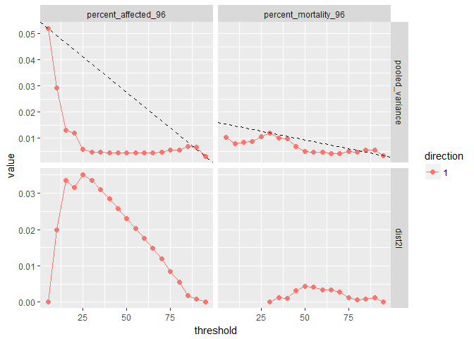

Overview
--------

The package provides an R interface for processing concentration response data using Curvep, a response noise filtering algorithm.

With a predefined baseline noise threshold (or a minimum response threshold) in an experiment, the program can calculate activity (with confidence interval) based on original or simulated concentration response data.

If the baseline noise threshold is unknown, the above process can be repeated using a reasonable number of threshold candidates. The optimal threshold is identified as the lowest threshold where variance of potency estimation is sufficiently reduced and even stabilized, under the condiction that there are enough response variations induced by chemicals in the dataset.

Currently simulated data can be generated from one of the three types of dataset:

1.  dichotomous binary incidence data by bootstraping incidence data (e.g., mortality data from alternative animal model data)
2.  continuous data with high number of replicates by bootstraping experimental data (e.g., alternative animal model data)
3.  continous data with low number of replicates by linear-fit of experimental data with vehicle control responses as random noise (e.g., in vitro data)

Installation
------------

``` r
# the development version from GitHub:
# install.packages("devtools")
devtools::install_github("moggces/Rcurvep")
devtools::install_github("moggces/Rcurvep", build_vignettes = TRUE)
```

Usage
-----

### baseline noise threshold identification

    ## $`1`



    ## 
    ## Threshold is: 25 ( OK ) for the endpoint: percent_affected_96 at: increasing direction
    ## Threshold is: 55 ( check ) for the endpoint: percent_mortality_96 at: increasing direction

    ## Threshold is: 25 ( OK ) for the endpoint: percent_affected_96 at: increasing direction
    ## Threshold is: 55 ( check ) for the endpoint: percent_mortality_96 at: increasing direction

More Usage
----------

To learn more about Rcurvep, start with the vignettes: `browseVignettes(package = "Rcurvep")`
