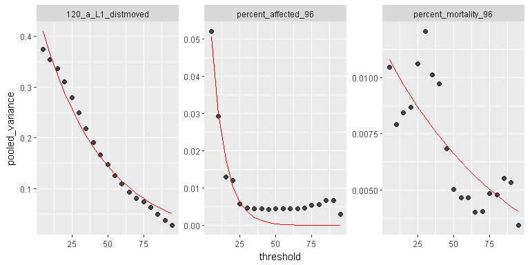
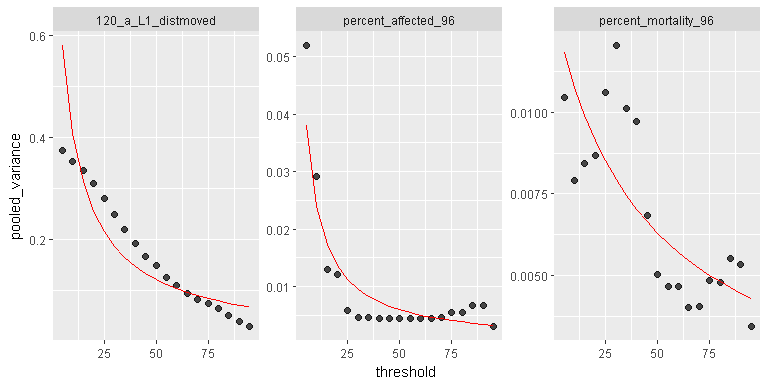
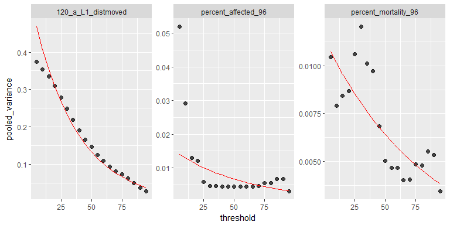
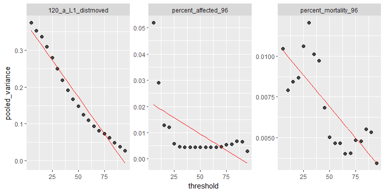
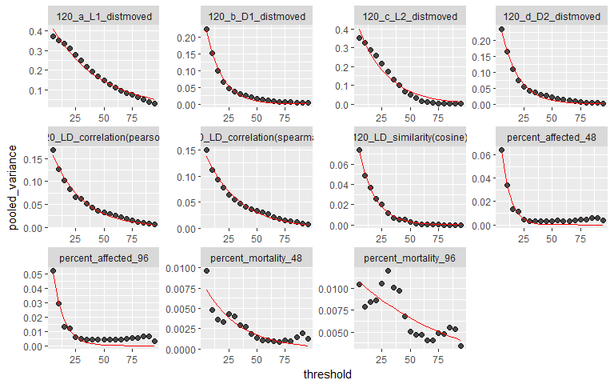
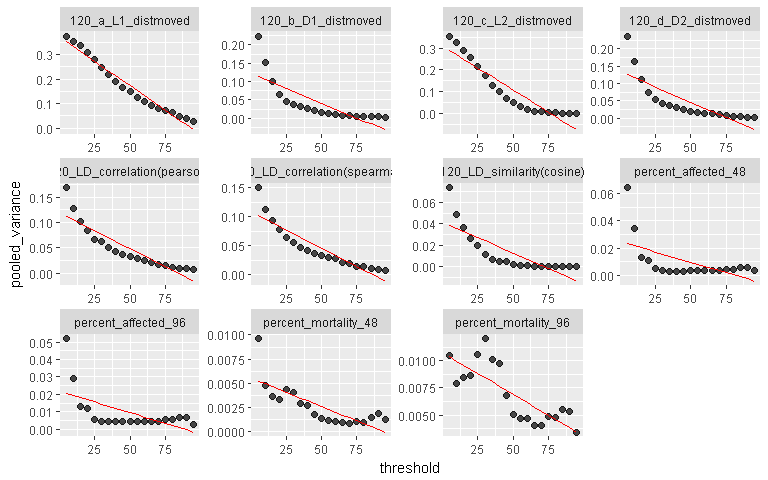

# Introduction
  
  The threshold approach intends to find the optimal response threshold at the inflection point (or "elbow") based on the data (x = threshold; y = pooled variance), manifested by a **exponential** relationship between threshold and pooled variance. 
  
  However, there are cases that there are no such inflection point existed:
  1. a **linear** relationship between threshold and pooled variance (too much noise in the dataset)
  2. a **polynomial** relationship between threshold and pooled variance (too little noise in the dataset)

# Goal

  To provide a funtion that can inform the user when the threshold approach cannnot be used or be warned.
  
# Steps

  1. Investigate approaches to do curve fitting
  2. Test approaches using three signature endpoints representing three types (exponential, linear, polynomial)
  3. Identify the best approach for exponential curve fit
  3. Apply the approach on all the endpoints
  

## read required R packages


```r
library(here)
library(dplyr)
library(tidyr)
library(purrr)
library(ggplot2)
library(stringr)
library(readr)
library(Rcurvep)
```

## get all and the signature endpoints
### allcurved (all endpoints)
### sigcurved (signature endpoints)


```r
percentd <- read_tsv(
  here("data-raw", "bmr_exclude", "percent_thres_all.txt"), col_types = cols())
distmd <- read_tsv(
  here("data-raw", "bmr_exclude", "distmoved_thres_all.txt"), col_types = cols())
simid <- read_tsv(
  here("data-raw", "bmr_exclude", "simi_thres_all.txt"), col_types = cols())

allcurved <- percentd %>% bind_rows(distmd) %>% bind_rows(simid)
sigcurved <- allcurved %>%
  filter(
    endpoint %in% c("percent_affected_96", "percent_mortality_96", "120_a_L1_distmoved")
  )
```

```
## Warning: package 'bindrcpp' was built under R version 3.3.3
```


## fitting functions
### nls + exponential


```r
#https://stats.stackexchange.com/questions/11947/fitting-an-exponential-model-to-data

nls_fit <- function(dd) {
  mod <- nls(pooled_variance ~ exp(a + b * threshold), 
             data = dd, start = list(a = 0, b = 0))
  result <- dd %>%
    mutate(
      fitted_value = fitted(mod)
    )
  return(list(update_dataset = result, model = mod))
}
```

### lm + log(y)


```r
# Joanne's suggestions

lm_log_fit <- function(dd) {
  mod <- lm(log(pooled_variance) ~ threshold , data = dd)
  result <- dd %>%
    mutate(
      fitted_value = exp(fitted(mod))
    )
  return(list(update_dataset = result, model = mod))
}
```


### glm + gamma


```r
#https://stats.stackexchange.com/questions/240455/fitting-exponential-regression-model-by-mle

glm_gamma_fit <- function(dd) {
  mod <- glm(pooled_variance ~ threshold , data = dd, family = Gamma(link = "inverse"))
  result <- dd %>%
    mutate(
      fitted_value = fitted(mod)
    )
  return(list(update_dataset = result, model = mod))
}
```

### lm (simple linear regression)


```r
lm_fit <- function(dd) {
  mod <- lm(pooled_variance ~ threshold , data = dd)
  result <- dd %>%
    mutate(
      fitted_value = fitted(mod)
    )
  return(list(update_dataset = result, model = mod))
}
```


### plot data and fitting results


```r
plot_fit_value <- function(dd) {
  p <- ggplot(dd, aes(x = threshold, y = pooled_variance))
  p <- p + geom_point(size = 2, alpha = 0.7) + 
    geom_line(aes(y = fitted_value), color = "red") + 
    facet_wrap( ~ endpoint, scales = "free")
  return(p)
}
```

### calculate R2 between original values and fitted values


```r
cal_fitted_r2 <- function(dd) {
  result <- cor(dd$pooled_variance, dd$fitted_value)^2
  return(result)
}
```


### compare R2 between nls + exponential and linear fit & add flag column


```r
add_threshold_flag <- function(threshold_data, exp_fit, linear_fit) {
  
  exp_out <- map_dbl(exp_fit, ~ cal_fitted_r2(.x[[1]])) %>% 
    tibble(exp_r2 = ., endpoint = names(exp_fit))
  linear_out <- map_dbl(linear_fit, ~ cal_fitted_r2(.x[[1]])) %>% 
    tibble(linear_r2 = ., endpoint = names(linear_fit))
  
  exp_out <- exp_out %>%
    left_join(
      linear_out, by = "endpoint"
    ) %>%
    mutate(
      threshold_flag = case_when(
        exp_r2 >= 0.95 & linear_r2 >= 0.95 ~ "warning",
        exp_r2 < 0.95 & linear_r2 < 0.95 ~ "do not use",
        TRUE ~ as.character(NA)
      )
    )
  
  result <- threshold_data %>%
    filter(thresDist == 1) %>%
    left_join(exp_out, by = "endpoint")
  
  return(result)

}
```


## Tests on signature endpoints 
### nls_fit


```r
nlsd <- sigcurved %>% 
  split(.$endpoint) %>%
  map(., nls_fit)

plot_fit_value(map_df(nlsd, ~ .x[[1]])) 
```

<!-- -->

The fits look good. Yet it will be better if the second one can fit better

### glm_gamma_fit


```r
glmd <- sigcurved %>% 
  split(.$endpoint) %>%
  map(., glm_gamma_fit)

plot_fit_value(map_df(glmd, ~ .x[[1]]))
```

<!-- -->

The fits do not look good.

### lm_log_fit


```r
lm_logd <- sigcurved %>% 
  split(.$endpoint) %>%
  map(., lm_log_fit)

plot_fit_value(map_df(lm_logd, ~ .x[[1]]))
```

<!-- -->

The fits do not look good.

### lm_fit


```r
lmd <- sigcurved %>% 
  split(.$endpoint) %>%
  map(., lm_fit)

plot_fit_value(map_df(lmd, ~ .x[[1]]))
```

<!-- -->

The fits do not look good.

## Identification of parameters to single out the exponential distribution vs others


```r
map_dbl(nlsd, ~ cal_fitted_r2(.x[[1]]))
```

```
##   120_a_L1_distmoved  percent_affected_96 percent_mortality_96 
##            0.9819616            0.9606155            0.6242799
```


```r
map_dbl(lmd, ~ cal_fitted_r2(.x[[1]]))
```

```
##   120_a_L1_distmoved  percent_affected_96 percent_mortality_96 
##            0.9673699            0.3451323            0.6337978
```

The **linear** curve shows high R2 in both nls + exponential fit and lm (linear fit).
But the **exponential** curve shows high R2 only in nls + exponential fit.
And the **polynomial** curve shows poor R2 in both nls + exponential fit and lm (linear fit).

## Apply the above logic to add flag on the thresholds


```r
add_threshold_flag(threshold_data =  sigcurved, exp_fit = nlsd, linear_fit = lmd)
```

```
## # A tibble: 3 x 13
##   endpoint        direction thresCurva thresDist threshold pooled_variance
##   <chr>               <int>      <int>     <int>     <int>           <dbl>
## 1 percent_affect~         1          1         1        25         0.00583
## 2 percent_mortal~         1          1         1        50         0.00503
## 3 120_a_L1_distm~         0          1         1        55         0.126  
## # ... with 7 more variables: dist2l <dbl>, curvature <dbl>, p1 <int>,
## #   p2 <int>, exp_r2 <dbl>, linear_r2 <dbl>, threshold_flag <chr>
```

The 120_a_L1_distmoved endpoint got a 'warning' flag and the percent_mortality_96 endpoint got a 'do not use' flag.


## Apply nls + exponential fit on all the endpoints


```r
nlsd_all <- allcurved %>% 
  split(.$endpoint) %>%
  map(., nls_fit)

plot_fit_value(map_df(nlsd_all, ~ .x[[1]])) 
```

<!-- -->


```r
lmd_all <- allcurved %>% 
  split(.$endpoint) %>%
  map(., lm_fit)

plot_fit_value(map_df(lmd_all, ~ .x[[1]]))
```

<!-- -->


```r
add_threshold_flag(threshold_data =  allcurved, exp_fit = nlsd_all, linear_fit = lmd_all)
```

```
## # A tibble: 11 x 13
##    endpoint       direction thresCurva thresDist threshold pooled_variance
##    <chr>              <int>      <int>     <int>     <int>           <dbl>
##  1 percent_affec~         1          0         1        15         0.0134 
##  2 percent_affec~         1          1         1        25         0.00583
##  3 percent_morta~         1          1         1        15         0.00360
##  4 percent_morta~         1          1         1        50         0.00503
##  5 120_a_L1_dist~         0          1         1        55         0.126  
##  6 120_b_D1_dist~         0          0         1        25         0.0459 
##  7 120_c_L2_dist~         0          1         1        45         0.0675 
##  8 120_d_D2_dist~         0          0         1        25         0.0545 
##  9 120_LD_correl~        -1          0         1        25         0.0666 
## 10 120_LD_correl~        -1          0         1        35         0.0471 
## 11 120_LD_simila~        -1          0         1        35         0.00704
## # ... with 7 more variables: dist2l <dbl>, curvature <dbl>, p1 <int>,
## #   p2 <int>, exp_r2 <dbl>, linear_r2 <dbl>, threshold_flag <chr>
```

The 120_a_L1_distmoved endpoint got a 'warning' flag and the percent_mortality_96 and percent_mortality_48 endpoint got a 'do not use' flag.


# Summary

Based on the current dataset, 

1. the nls + exponential fit approach can generate reasonable fit (visually).
2. the R2 approach by combining information from both nls + exponential fit and linear fit approach can reliably provide the flag for the endpoints that should not use the threshold approach. 


`


